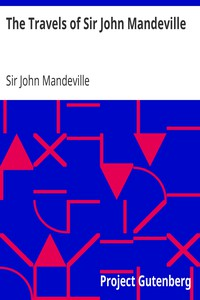

# The Travels of Sir John Mandeville <kbd>v2.2.1</kbd>

## Authors

 - Mandeville, John, Sir <small>(-1 - -1)</small>

## Translators

## Subjects

 - Geography, Medieval
 - Mandeville, John, Sir
 - Orient
 - Palestine
 - Voyages and travels

## Readablility

 - **A1:** 81%
 - **A2:** 86%
 - **B1:** 91%
 - **B2:** 95%
 - **C1:** 98%
 - **C2:** 100%

## Words Count

 - **A1:** 462
 - **A2:** 348
 - **B1:** 563
 - **B2:** 748
 - **C1:** 748
 - **C2:** 486

## Source

<kbd>GUTHENBURGE:782</kbd>
