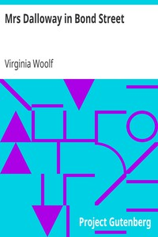

# Mrs Dalloway in Bond Street <kbd>v2.2.1</kbd>

## Authors

 - Woolf, Virginia <small>(1882 - 1941)</small>

## Translators

## Subjects

 - English fiction
 - London (England)
 - Married women
 - Short stories, English

## Readablility

 - **A1:** 71%
 - **A2:** 78%
 - **B1:** 86%
 - **B2:** 93%
 - **C1:** 99%
 - **C2:** 100%

## Words Count

 - **A1:** 370
 - **A2:** 174
 - **B1:** 241
 - **B2:** 274
 - **C1:** 194
 - **C2:** 55

## Source

<kbd>GUTHENBURGE:63107</kbd>
