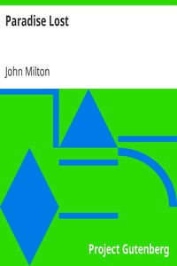

# Paradise Lost <kbd>v2.0.2</kbd>

## Authors

 - Milton, John <small>(1608 - 1674)</small>

## Translators

## Subjects

 - Adam (Biblical figure)
 - Bible. Genesis
 - Eve (Biblical figure)
 - Fall of man

## Readablility

 - **A1:** 40%
 - **A2:** 45%
 - **B1:** 56%
 - **B2:** 70%
 - **C1:** 74%
 - **C2:** 100%

## Words Count

 - **A1:** 494
 - **A2:** 414
 - **B1:** 753
 - **B2:** 1166
 - **C1:** 524
 - **C2:** 7756

## Source

<kbd>GUTHENBURGE:20</kbd>
