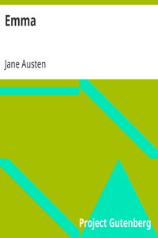

# Emma <kbd>v2.2.0</kbd>

## Authors

 - Austen, Jane <small>(1775 - 1817)</small>

## Translators

## Subjects

 - Bildungsromans
 - England
 - Fathers and daughters
 - Female friendship
 - Humorous stories
 - Love stories
 - Mate selection
 - Young women

## Readablility

 - **A1:** 81%
 - **A2:** 86%
 - **B1:** 92%
 - **B2:** 96%
 - **C1:** 99%
 - **C2:** 100%

## Words Count

 - **A1:** 2410
 - **A2:** 462
 - **B1:** 838
 - **B2:** 1297
 - **C1:** 1576
 - **C2:** 862

## Source

<kbd>GUTHENBURGE:158</kbd>
