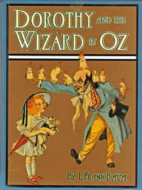

# Dorothy and the Wizard in Oz <kbd>v2.2.1</kbd>

## Authors

 - Baum, L. Frank (Lyman Frank) <small>(1856 - 1919)</small>

## Translators

## Subjects

 - Cats
 - Cousins
 - Dragons
 - Earthquakes
 - Fantasy literature
 - Friendship
 - Gale, Dorothy (Fictitious character)
 - Kittens
 - Magic
 - Mountains
 - Nephews
 - Oz (Imaginary place)
 - Piglets
 - Ranches
 - Trials
 - Wizard of Oz (Fictitious character)

## Readablility

 - **A1:** 75%
 - **A2:** 82%
 - **B1:** 88%
 - **B2:** 94%
 - **C1:** 97%
 - **C2:** 100%

## Words Count

 - **A1:** 480
 - **A2:** 425
 - **B1:** 700
 - **B2:** 892
 - **C1:** 799
 - **C2:** 333

## Source

<kbd>GUTHENBURGE:22566</kbd>
