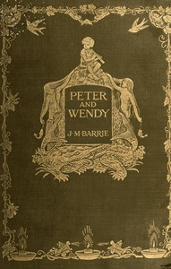

# Peter and Wendy <kbd>v2.3.0</kbd>

## Authors

 - Barrie, J. M. (James Matthew) <small>(1860 - 1937)</small>

## Translators

## Subjects

 - Fairies
 - Fantasy literature
 - Never-Never Land (Imaginary place)
 - Peter Pan (Fictitious character)
 - Pirates

## Readablility

 - **A1:** 78%
 - **A2:** 84%
 - **B1:** 89%
 - **B2:** 94%
 - **C1:** 98%
 - **C2:** 100%

## Words Count

 - **A1:** 488
 - **A2:** 428
 - **B1:** 691
 - **B2:** 945
 - **C1:** 911
 - **C2:** 547

## Source

<kbd>GUTHENBURGE:26654</kbd>
