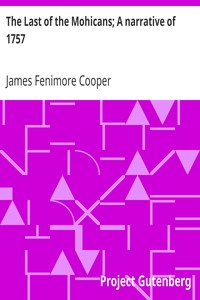

# The Last of the Mohicans; A narrative of 1757 <kbd>v2.0.2</kbd>

## Authors

 - Cooper, James Fenimore <small>(1789 - 1851)</small>

## Translators

## Subjects

 - Adventure stories
 - Bumppo, Natty (Fictitious character)
 - Frontier and pioneer life
 - Historical fiction
 - Mohegan Indians
 - United States
 - War stories

## Readablility

 - **A1:** 50%
 - **A2:** 57%
 - **B1:** 68%
 - **B2:** 83%
 - **C1:** 87%
 - **C2:** 100%

## Words Count

 - **A1:** 599
 - **A2:** 588
 - **B1:** 991
 - **B2:** 1755
 - **C1:** 752
 - **C2:** 5497

## Source

<kbd>GUTHENBURGE:940</kbd>
