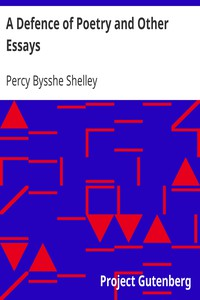

# A Defence of Poetry and Other Essays <kbd>v2.2.1</kbd>

## Authors

 - Shelley, Percy Bysshe <small>(1792 - 1822)</small>

## Translators

## Subjects

 - English essays
 - Poetry

## Readablility

 - **A1:** 71%
 - **A2:** 77%
 - **B1:** 84%
 - **B2:** 92%
 - **C1:** 98%
 - **C2:** 100%

## Words Count

 - **A1:** 439
 - **A2:** 331
 - **B1:** 545
 - **B2:** 820
 - **C1:** 887
 - **C2:** 512

## Source

<kbd>GUTHENBURGE:5428</kbd>
