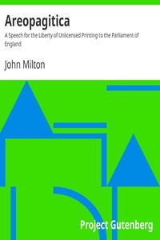

# Areopagitica: A Speech for the Liberty of Unlicensed Printing to the Parliament of England <kbd>v2.3.0</kbd>

## Authors

 - Milton, John <small>(1608 - 1674)</small>

## Translators

## Subjects

 - Freedom of the press

## Readablility

 - **A1:** 75%
 - **A2:** 81%
 - **B1:** 86%
 - **B2:** 92%
 - **C1:** 97%
 - **C2:** 100%

## Words Count

 - **A1:** 442
 - **A2:** 323
 - **B1:** 496
 - **B2:** 697
 - **C1:** 710
 - **C2:** 465

## Source

<kbd>GUTHENBURGE:608</kbd>
