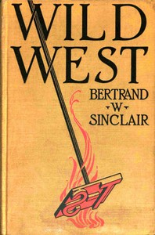

# Wild west <kbd>v2.2.1</kbd>

## Authors

 - Sinclair, Bertrand W. <small>(1881 - 1972)</small>

## Translators

## Subjects

 - Cattle stealing
 - Montana
 - Ranch life
 - Ranches
 - Western stories

## Readablility

 - **A1:** 74%
 - **A2:** 80%
 - **B1:** 86%
 - **B2:** 93%
 - **C1:** 98%
 - **C2:** 100%

## Words Count

 - **A1:** 490
 - **A2:** 455
 - **B1:** 785
 - **B2:** 1116
 - **C1:** 1252
 - **C2:** 870

## Source

<kbd>GUTHENBURGE:68084</kbd>
