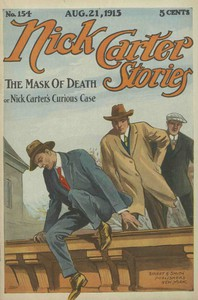

# Nick Carter Stories No. 154, August 21, 1915: The mask of death; or, Nick Carter's curious case. <kbd>v2.2.1</kbd>

## Authors

 - Carter, Nicholas (House name) <small>(-1 - -1)</small>
 - Lebhar, Bertram <small>(-1 - -1)</small>

## Translators

## Subjects

 - Detective and mystery stories, American
 - Popular literature

## Readablility

 - **A1:** 72%
 - **A2:** 79%
 - **B1:** 85%
 - **B2:** 91%
 - **C1:** 97%
 - **C2:** 100%

## Words Count

 - **A1:** 487
 - **A2:** 444
 - **B1:** 698
 - **B2:** 930
 - **C1:** 942
 - **C2:** 560

## Source

<kbd>GUTHENBURGE:68140</kbd>
