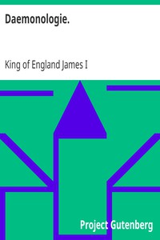

# Daemonologie. <kbd>v2.3.0</kbd>

## Authors

 - James I, King of England <small>(1566 - 1625)</small>

## Translators

## Subjects

 - Demonology
 - Fian, John, -1591
 - Magic
 - Witchcraft

## Readablility

 - **A1:** 85%
 - **A2:** 89%
 - **B1:** 92%
 - **B2:** 96%
 - **C1:** 99%
 - **C2:** 100%

## Words Count

 - **A1:** 400
 - **A2:** 242
 - **B1:** 370
 - **B2:** 441
 - **C1:** 373
 - **C2:** 182

## Source

<kbd>GUTHENBURGE:25929</kbd>
