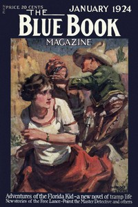

# The Plymouth Express Affair <kbd>v2.3.0</kbd>

## Authors

 - Christie, Agatha <small>(1890 - 1976)</small>

## Translators

## Subjects

 - Detective and mystery stories
 - Murder
 - Poirot, Hercule (Fictitious character)
 - Short stories

## Readablility

 - **A1:** 73%
 - **A2:** 80%
 - **B1:** 87%
 - **B2:** 94%
 - **C1:** 99%
 - **C2:** 100%

## Words Count

 - **A1:** 394
 - **A2:** 207
 - **B1:** 270
 - **B2:** 325
 - **C1:** 205
 - **C2:** 61

## Source

<kbd>GUTHENBURGE:66446</kbd>
