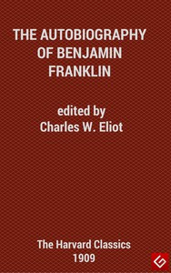

# The Autobiography of Benjamin Franklin <kbd>v2.2.1</kbd>

## Authors

 - Franklin, Benjamin <small>(1706 - 1790)</small>

## Translators

## Subjects

 - Franklin, Benjamin, 1706-1790
 - Statesmen

## Readablility

 - **A1:** 77%
 - **A2:** 83%
 - **B1:** 89%
 - **B2:** 94%
 - **C1:** 98%
 - **C2:** 100%

## Words Count

 - **A1:** 489
 - **A2:** 457
 - **B1:** 772
 - **B2:** 1176
 - **C1:** 1314
 - **C2:** 656

## Source

<kbd>GUTHENBURGE:148</kbd>
