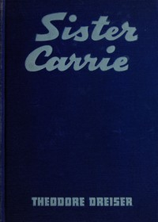

# Sister Carrie: A Novel <kbd>v2.3.0</kbd>

## Authors

 - Dreiser, Theodore <small>(1871 - 1945)</small>

## Translators

## Subjects

 - Chicago (Ill.)
 - Didactic fiction
 - Mistresses
 - New York (N.Y.)
 - Young women

## Readablility

 - **A1:** 78%
 - **A2:** 84%
 - **B1:** 90%
 - **B2:** 95%
 - **C1:** 98%
 - **C2:** 100%

## Words Count

 - **A1:** 491
 - **A2:** 482
 - **B1:** 906
 - **B2:** 1518
 - **C1:** 1903
 - **C2:** 1370

## Source

<kbd>GUTHENBURGE:233</kbd>
