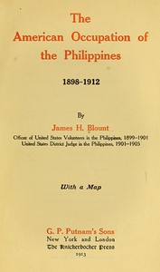

# The American Occupation of the Philippines 1898-1912 <kbd>v2.2.1</kbd>

## Authors

 - Blount, James H. (James Henderson) <small>(1869 - 1918)</small>

## Translators

## Subjects

 - Philippines
 - Philippines

## Readablility

 - **A1:** 73%
 - **A2:** 79%
 - **B1:** 85%
 - **B2:** 92%
 - **C1:** 97%
 - **C2:** 100%

## Words Count

 - **A1:** 491
 - **A2:** 482
 - **B1:** 919
 - **B2:** 1622
 - **C1:** 2151
 - **C2:** 1824

## Source

<kbd>GUTHENBURGE:36542</kbd>
