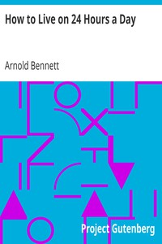

# How to Live on 24 Hours a Day <kbd>v2.2.1</kbd>

## Authors

 - Bennett, Arnold <small>(1867 - 1931)</small>

## Translators

## Subjects

 - Conduct of life
 - Time management
 - Values

## Readablility

 - **A1:** 73%
 - **A2:** 80%
 - **B1:** 87%
 - **B2:** 93%
 - **C1:** 98%
 - **C2:** 100%

## Words Count

 - **A1:** 429
 - **A2:** 306
 - **B1:** 456
 - **B2:** 551
 - **C1:** 488
 - **C2:** 207

## Source

<kbd>GUTHENBURGE:2274</kbd>
