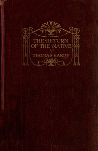

# The Return of the Native <kbd>v2.3.0</kbd>

## Authors

 - Hardy, Thomas <small>(1840 - 1928)</small>

## Translators

## Subjects

 - Adultery
 - Didactic fiction
 - Heathlands
 - Love stories
 - Mate selection
 - Mothers and sons
 - People with visual disabilities
 - Wessex (England)

## Readablility

 - **A1:** 79%
 - **A2:** 84%
 - **B1:** 90%
 - **B2:** 94%
 - **C1:** 98%
 - **C2:** 100%

## Words Count

 - **A1:** 493
 - **A2:** 486
 - **B1:** 933
 - **B2:** 1573
 - **C1:** 2065
 - **C2:** 1539

## Source

<kbd>GUTHENBURGE:122</kbd>
