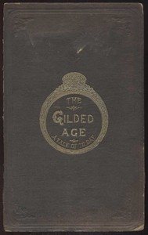

# The Gilded Age: A Tale of Today <kbd>v2.3.0</kbd>

## Authors

 - Twain, Mark <small>(1835 - 1910)</small>
 - Warner, Charles Dudley <small>(1829 - 1900)</small>

## Translators

## Subjects

 - Businessmen
 - Legislators
 - Political corruption
 - Political fiction
 - Satire
 - Speculation
 - Washington (D.C.)

## Readablility

 - **A1:** 77%
 - **A2:** 83%
 - **B1:** 88%
 - **B2:** 94%
 - **C1:** 98%
 - **C2:** 100%

## Words Count

 - **A1:** 495
 - **A2:** 493
 - **B1:** 959
 - **B2:** 1748
 - **C1:** 2440
 - **C2:** 1698

## Source

<kbd>GUTHENBURGE:3178</kbd>
