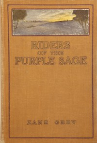

# Riders of the Purple Sage <kbd>v2.3.0</kbd>

## Authors

 - Grey, Zane <small>(1872 - 1939)</small>

## Translators

## Subjects

 - Mormon women
 - Polygamy
 - Utah
 - Western stories
 - Women ranchers

## Readablility

 - **A1:** 76%
 - **A2:** 82%
 - **B1:** 88%
 - **B2:** 94%
 - **C1:** 98%
 - **C2:** 100%

## Words Count

 - **A1:** 484
 - **A2:** 457
 - **B1:** 834
 - **B2:** 1283
 - **C1:** 1493
 - **C2:** 1061

## Source

<kbd>GUTHENBURGE:1300</kbd>
