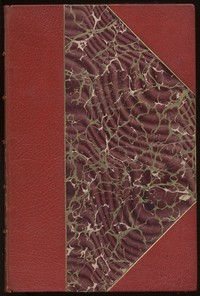

# Waverley; Or, 'Tis Sixty Years Since <kbd>v2.3.0</kbd>

## Authors

 - Scott, Walter <small>(1771 - 1832)</small>

## Translators

## Subjects

 - Historical fiction
 - Jacobite Rebellion, 1745-1746

## Readablility

 - **A1:** 74%
 - **A2:** 80%
 - **B1:** 86%
 - **B2:** 92%
 - **C1:** 97%
 - **C2:** 100%

## Words Count

 - **A1:** 494
 - **A2:** 497
 - **B1:** 977
 - **B2:** 1839
 - **C1:** 2853
 - **C2:** 2500

## Source

<kbd>GUTHENBURGE:5998</kbd>
