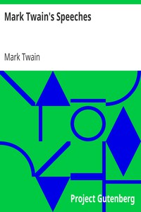

# Mark Twain's Speeches <kbd>v2.3.0</kbd>

## Authors

 - Twain, Mark <small>(1835 - 1910)</small>

## Translators

## Subjects

 - Speeches, addresses, etc., American

## Readablility

 - **A1:** 78%
 - **A2:** 84%
 - **B1:** 89%
 - **B2:** 94%
 - **C1:** 98%
 - **C2:** 100%

## Words Count

 - **A1:** 493
 - **A2:** 486
 - **B1:** 894
 - **B2:** 1424
 - **C1:** 1651
 - **C2:** 1065

## Source

<kbd>GUTHENBURGE:3188</kbd>
