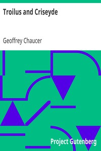

# Troilus and Criseyde <kbd>v2.3.0</kbd>

## Authors

 - Chaucer, Geoffrey <small>(1342 - 1400)</small>

## Translators

## Subjects

 - Cressida (Fictitious character)
 - Troilus (Legendary character)
 - Trojan War
 - Troy (Extinct city)

## Readablility

 - **A1:** 89%
 - **A2:** 91%
 - **B1:** 93%
 - **B2:** 95%
 - **C1:** 97%
 - **C2:** 100%

## Words Count

 - **A1:** 316
 - **A2:** 183
 - **B1:** 255
 - **B2:** 323
 - **C1:** 240
 - **C2:** 171

## Source

<kbd>GUTHENBURGE:257</kbd>
