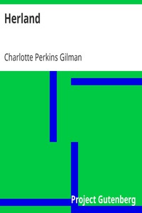

# Herland <kbd>v2.3.0</kbd>

## Authors

 - Gilman, Charlotte Perkins <small>(1860 - 1935)</small>

## Translators

## Subjects

 - Black humor
 - Utopian fiction
 - Utopias
 - Women

## Readablility

 - **A1:** 77%
 - **A2:** 83%
 - **B1:** 89%
 - **B2:** 94%
 - **C1:** 98%
 - **C2:** 100%

## Words Count

 - **A1:** 486
 - **A2:** 457
 - **B1:** 809
 - **B2:** 1119
 - **C1:** 1155
 - **C2:** 652

## Source

<kbd>GUTHENBURGE:32</kbd>
