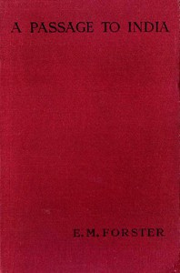

# A Passage to India <kbd>v2.0.9</kbd>

## Authors

 - Forster, E. M. (Edward Morgan) <small>(1879 - 1970)</small>

## Translators

## Subjects

 - British
 - India
 - Political fiction
 - Race relations

## Readablility

 - **A1:** 68%
 - **A2:** 74%
 - **B1:** 80%
 - **B2:** 86%
 - **C1:** 87%
 - **C2:** 100%

## Words Count

 - **A1:** 874
 - **A2:** 724
 - **B1:** 1106
 - **B2:** 1524
 - **C1:** 544
 - **C2:** 4800

## Source

<kbd>GUTHENBURGE:61221</kbd>
