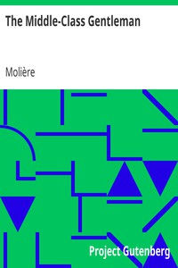

# The Middle-Class Gentleman <kbd>v2.3.0</kbd>

## Authors

 - Molière <small>(1622 - 1673)</small>

## Translators

 - Jones, Philip Dwight <small>(-1 - -1)</small>

## Subjects

 - Comedies
 - France
 - French drama
 - Middle class

## Readablility

 - **A1:** 77%
 - **A2:** 84%
 - **B1:** 89%
 - **B2:** 94%
 - **C1:** 98%
 - **C2:** 100%

## Words Count

 - **A1:** 440
 - **A2:** 308
 - **B1:** 443
 - **B2:** 480
 - **C1:** 401
 - **C2:** 190

## Source

<kbd>GUTHENBURGE:2992</kbd>
