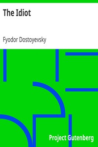

# The Idiot <kbd>v2.3.0</kbd>

## Authors

 - Dostoyevsky, Fyodor <small>(1821 - 1881)</small>

## Translators

 - Martin, Eva (Translator) <small>(-1 - -1)</small>

## Subjects

 - Historical fiction
 - Russia

## Readablility

 - **A1:** 80%
 - **A2:** 85%
 - **B1:** 91%
 - **B2:** 96%
 - **C1:** 99%
 - **C2:** 100%

## Words Count

 - **A1:** 492
 - **A2:** 490
 - **B1:** 938
 - **B2:** 1662
 - **C1:** 2186
 - **C2:** 1427

## Source

<kbd>GUTHENBURGE:2638</kbd>
