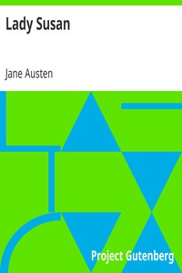

# Lady Susan <kbd>v2.2.1</kbd>

## Authors

 - Austen, Jane <small>(1775 - 1817)</small>

## Translators

## Subjects

 - England
 - Epistolary fiction
 - Mate selection
 - Mothers and daughters
 - Widows

## Readablility

 - **A1:** 78%
 - **A2:** 84%
 - **B1:** 90%
 - **B2:** 95%
 - **C1:** 99%
 - **C2:** 100%

## Words Count

 - **A1:** 452
 - **A2:** 344
 - **B1:** 537
 - **B2:** 634
 - **C1:** 552
 - **C2:** 218

## Source

<kbd>GUTHENBURGE:946</kbd>
