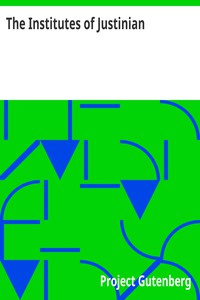

# The Institutes of Justinian <kbd>v2.2.1</kbd>

## Authors

## Translators

 - Moyle, John Baron <small>(1852 - 1930)</small>

## Subjects

 - Roman law

## Readablility

 - **A1:** 75%
 - **A2:** 81%
 - **B1:** 86%
 - **B2:** 93%
 - **C1:** 97%
 - **C2:** 100%

## Words Count

 - **A1:** 454
 - **A2:** 378
 - **B1:** 580
 - **B2:** 841
 - **C1:** 848
 - **C2:** 538

## Source

<kbd>GUTHENBURGE:5983</kbd>
