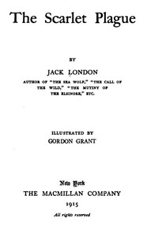

# The Scarlet Plague <kbd>v2.2.1</kbd>

## Authors

 - London, Jack <small>(1876 - 1916)</small>

## Translators

## Subjects

 - End of the world
 - Epidemics
 - Regression (Civilization)
 - Science fiction

## Readablility

 - **A1:** 76%
 - **A2:** 81%
 - **B1:** 88%
 - **B2:** 93%
 - **C1:** 98%
 - **C2:** 100%

## Words Count

 - **A1:** 466
 - **A2:** 361
 - **B1:** 545
 - **B2:** 684
 - **C1:** 552
 - **C2:** 288

## Source

<kbd>GUTHENBURGE:21970</kbd>
