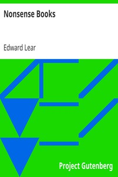

# Nonsense Books <kbd>v2.3.0</kbd>

## Authors

 - Lear, Edward <small>(1812 - 1888)</small>

## Translators

## Subjects

 - English wit and humor
 - Humorous poetry, English
 - Limericks, Juvenile
 - Nonsense verses, English

## Readablility

 - **A1:** 74%
 - **A2:** 80%
 - **B1:** 86%
 - **B2:** 92%
 - **C1:** 96%
 - **C2:** 100%

## Words Count

 - **A1:** 470
 - **A2:** 384
 - **B1:** 611
 - **B2:** 762
 - **C1:** 783
 - **C2:** 561

## Source

<kbd>GUTHENBURGE:13650</kbd>
