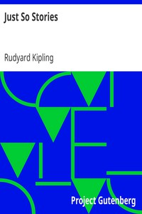

# Just So Stories <kbd>v2.2.1</kbd>

## Authors

 - Kipling, Rudyard <small>(1865 - 1936)</small>

## Translators

## Subjects

 - Animals
 - Children's stories, English
 - Short stories

## Readablility

 - **A1:** 76%
 - **A2:** 82%
 - **B1:** 88%
 - **B2:** 93%
 - **C1:** 96%
 - **C2:** 100%

## Words Count

 - **A1:** 448
 - **A2:** 336
 - **B1:** 466
 - **B2:** 522
 - **C1:** 446
 - **C2:** 274

## Source

<kbd>GUTHENBURGE:2781</kbd>
