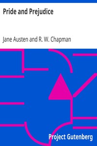

# Pride and Prejudice <kbd>v2.0.9</kbd>

## Authors

 - Austen, Jane <small>(1775 - 1817)</small>

## Translators

## Subjects

 - Courtship
 - Domestic fiction
 - England
 - Love stories
 - Sisters
 - Social classes
 - Young women

## Readablility

 - **A1:** 71%
 - **A2:** 77%
 - **B1:** 82%
 - **B2:** 87%
 - **C1:** 88%
 - **C2:** 100%

## Words Count

 - **A1:** 787
 - **A2:** 588
 - **B1:** 857
 - **B2:** 1070
 - **C1:** 348
 - **C2:** 3042

## Source

<kbd>GUTHENBURGE:42671</kbd>
