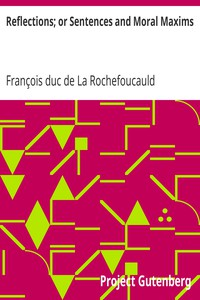

# Reflections; or Sentences and Moral Maxims <kbd>v2.2.1</kbd>

## Authors

 - La Rochefoucauld, François duc de <small>(1613 - 1680)</small>

## Translators

 - Friswell, J. Hain (James Hain) <small>(1825 - 1878)</small>
 - Willis Bund, J. W. (John William) <small>(1843 - 1928)</small>

## Subjects

 - Maxims

## Readablility

 - **A1:** 74%
 - **A2:** 81%
 - **B1:** 87%
 - **B2:** 94%
 - **C1:** 98%
 - **C2:** 100%

## Words Count

 - **A1:** 468
 - **A2:** 388
 - **B1:** 629
 - **B2:** 873
 - **C1:** 827
 - **C2:** 450

## Source

<kbd>GUTHENBURGE:9105</kbd>
