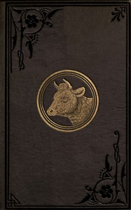

# Keeping one cow: Being the experience of a number of practical writers, in a clear and condensed form, upon the management of a single milch cow <kbd>v2.3.0</kbd>

## Authors

 - Various <small>(-1 - -1)</small>

## Translators

## Subjects

 - Cows
 - Dairying

## Readablility

 - **A1:** 70%
 - **A2:** 77%
 - **B1:** 84%
 - **B2:** 91%
 - **C1:** 97%
 - **C2:** 100%

## Words Count

 - **A1:** 472
 - **A2:** 391
 - **B1:** 587
 - **B2:** 766
 - **C1:** 786
 - **C2:** 451

## Source

<kbd>GUTHENBURGE:68093</kbd>
