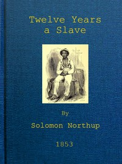

# Twelve Years a Slave: Narrative of Solomon Northup, a Citizen of New-York, Kidnapped in Washington City in 1841, and Rescued in 1853, from a Cotton Plantation near the Red River in Louisiana <kbd>v2.3.0</kbd>

## Authors

 - Northup, Solomon <small>(1808 - -1)</small>

## Translators

## Subjects

 - African Americans
 - Northup, Solomon, 1808-1863?
 - Plantation life
 - Slavery
 - Slaves
 - Slaves' writings, American

## Readablility

 - **A1:** 74%
 - **A2:** 80%
 - **B1:** 86%
 - **B2:** 93%
 - **C1:** 98%
 - **C2:** 100%

## Words Count

 - **A1:** 493
 - **A2:** 482
 - **B1:** 879
 - **B2:** 1428
 - **C1:** 1658
 - **C2:** 933

## Source

<kbd>GUTHENBURGE:45631</kbd>
