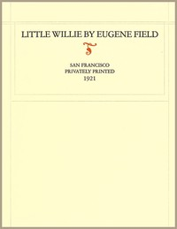

# Little Willie <kbd>v2.3.0</kbd>

## Authors

 - Field, Eugene <small>(1850 - 1895)</small>

## Translators

## Subjects

 - Enuresis
 - Humorous poetry

## Readablility

 - **A1:** 67%
 - **A2:** 75%
 - **B1:** 84%
 - **B2:** 93%
 - **C1:** 99%
 - **C2:** 100%

## Words Count

 - **A1:** 219
 - **A2:** 89
 - **B1:** 122
 - **B2:** 164
 - **C1:** 94
 - **C2:** 22

## Source

<kbd>GUTHENBURGE:68098</kbd>
