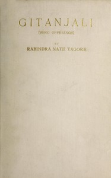

# Gitanjali <kbd>v2.3.0</kbd>

## Authors

 - Tagore, Rabindranath <small>(1861 - 1941)</small>

## Translators

## Subjects

 - Bengali poetry
 - Indic poetry
 - Prose poems, Bengali
 - Tagore, Rabindranath, 1861-1941

## Readablility

 - **A1:** 74%
 - **A2:** 81%
 - **B1:** 87%
 - **B2:** 94%
 - **C1:** 98%
 - **C2:** 100%

## Words Count

 - **A1:** 443
 - **A2:** 290
 - **B1:** 410
 - **B2:** 567
 - **C1:** 456
 - **C2:** 223

## Source

<kbd>GUTHENBURGE:7164</kbd>
