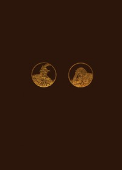

# Faust: A Tragedy <kbd>v2.2.1</kbd>

## Authors

 - Goethe, Johann Wolfgang von <small>(1749 - 1832)</small>

## Translators

 - Blackie, John Stuart <small>(1809 - 1895)</small>

## Subjects

 - Faust, -approximately 1540
 - Tragedies

## Readablility

 - **A1:** 73%
 - **A2:** 79%
 - **B1:** 85%
 - **B2:** 91%
 - **C1:** 97%
 - **C2:** 100%

## Words Count

 - **A1:** 491
 - **A2:** 452
 - **B1:** 819
 - **B2:** 1254
 - **C1:** 1541
 - **C2:** 1184

## Source

<kbd>GUTHENBURGE:63203</kbd>
