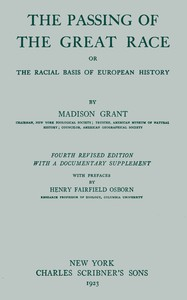

# The passing of the great race,: or, The racial basis of European history <kbd>v2.2.1</kbd>

## Authors

 - Grant, Madison <small>(1865 - 1937)</small>

## Translators

## Subjects

## Readablility

 - **A1:** 73%
 - **A2:** 79%
 - **B1:** 85%
 - **B2:** 91%
 - **C1:** 96%
 - **C2:** 100%

## Words Count

 - **A1:** 478
 - **A2:** 432
 - **B1:** 751
 - **B2:** 1173
 - **C1:** 1460
 - **C2:** 1127

## Source

<kbd>GUTHENBURGE:68185</kbd>
