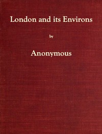

# London and Its Environs Described, vol. 1 (of 6): Containing an Account of Whatever is Most Remarkable for Grandeur, Elegance, Curiosity or Use, in the City and in the Country Twenty Miles Round It <kbd>v2.2.1</kbd>

## Authors

 - Anonymous <small>(-1 - -1)</small>

## Translators

## Subjects

 - London (England)
 - London (England)

## Readablility

 - **A1:** 71%
 - **A2:** 79%
 - **B1:** 85%
 - **B2:** 91%
 - **C1:** 97%
 - **C2:** 100%

## Words Count

 - **A1:** 474
 - **A2:** 419
 - **B1:** 689
 - **B2:** 1027
 - **C1:** 1184
 - **C2:** 685

## Source

<kbd>GUTHENBURGE:59466</kbd>
