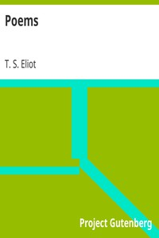

# Poems <kbd>v2.2.1</kbd>

## Authors

 - Eliot, T. S. (Thomas Stearns) <small>(1888 - 1965)</small>

## Translators

## Subjects

 - Poetry

## Readablility

 - **A1:** 71%
 - **A2:** 78%
 - **B1:** 85%
 - **B2:** 91%
 - **C1:** 97%
 - **C2:** 100%

## Words Count

 - **A1:** 397
 - **A2:** 245
 - **B1:** 328
 - **B2:** 405
 - **C1:** 380
 - **C2:** 222

## Source

<kbd>GUTHENBURGE:1567</kbd>
