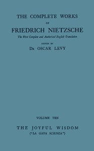

# The Joyful Wisdom ("La Gaya Scienza") <kbd>v2.2.1</kbd>

## Authors

 - Nietzsche, Friedrich Wilhelm <small>(1844 - 1900)</small>

## Translators

 - Cohn, Paul V. (Paul Victor) <small>(-1 - -1)</small>
 - Petre, Maude Dominica <small>(1863 - 1942)</small>
 - Common, Thomas <small>(1850 - 1919)</small>

## Subjects

 - Philosophy

## Readablility

 - **A1:** 74%
 - **A2:** 80%
 - **B1:** 86%
 - **B2:** 92%
 - **C1:** 97%
 - **C2:** 100%

## Words Count

 - **A1:** 491
 - **A2:** 464
 - **B1:** 832
 - **B2:** 1350
 - **C1:** 1669
 - **C2:** 1308

## Source

<kbd>GUTHENBURGE:52881</kbd>
