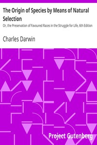

# The Origin of Species by Means of Natural Selection: Or, the Preservation of Favoured Races in the Struggle for Life, 6th Edition <kbd>v2.3.0</kbd>

## Authors

 - Darwin, Charles <small>(1809 - 1882)</small>

## Translators

## Subjects

 - Evolution (Biology)
 - Natural selection

## Readablility

 - **A1:** 69%
 - **A2:** 75%
 - **B1:** 83%
 - **B2:** 90%
 - **C1:** 96%
 - **C2:** 100%

## Words Count

 - **A1:** 477
 - **A2:** 415
 - **B1:** 728
 - **B2:** 1132
 - **C1:** 1479
 - **C2:** 1187

## Source

<kbd>GUTHENBURGE:2009</kbd>
