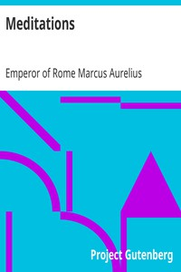

# Meditations <kbd>v2.0.2</kbd>

## Authors

 - Marcus Aurelius, Emperor of Rome <small>(121 - 180)</small>

## Translators

## Subjects

 - Ethics
 - Life
 - Stoics

## Readablility

 - **A1:** 50%
 - **A2:** 58%
 - **B1:** 69%
 - **B2:** 82%
 - **C1:** 86%
 - **C2:** 100%

## Words Count

 - **A1:** 541
 - **A2:** 424
 - **B1:** 699
 - **B2:** 1075
 - **C1:** 431
 - **C2:** 3251

## Source

<kbd>GUTHENBURGE:2680</kbd>
