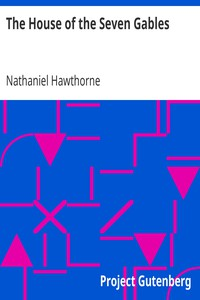

# The House of the Seven Gables <kbd>v2.3.0</kbd>

## Authors

 - Hawthorne, Nathaniel <small>(1804 - 1864)</small>

## Translators

## Subjects

 - Domestic fiction
 - Haunted houses
 - Historical fiction
 - Paranormal fiction
 - Salem (Mass.)

## Readablility

 - **A1:** 74%
 - **A2:** 79%
 - **B1:** 85%
 - **B2:** 92%
 - **C1:** 97%
 - **C2:** 100%

## Words Count

 - **A1:** 492
 - **A2:** 478
 - **B1:** 907
 - **B2:** 1563
 - **C1:** 2174
 - **C2:** 1562

## Source

<kbd>GUTHENBURGE:77</kbd>
