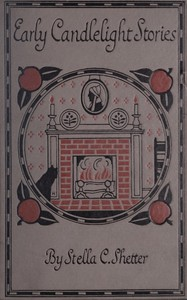

# Early candlelight stories <kbd>v2.3.0</kbd>

## Authors

 - Shetter, Stella C. <small>(-1 - -1)</small>

## Translators

## Subjects

 - Brothers and sisters
 - Children
 - Children's stories
 - Grandmothers
 - Storytelling

## Readablility

 - **A1:** 78%
 - **A2:** 84%
 - **B1:** 89%
 - **B2:** 94%
 - **C1:** 98%
 - **C2:** 100%

## Words Count

 - **A1:** 476
 - **A2:** 387
 - **B1:** 594
 - **B2:** 751
 - **C1:** 662
 - **C2:** 371

## Source

<kbd>GUTHENBURGE:68151</kbd>
