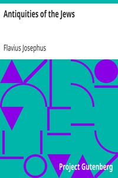

# Antiquities of the Jews <kbd>v2.2.1</kbd>

## Authors

 - Josephus, Flavius <small>(37 - -1)</small>

## Translators

 - Whiston, William <small>(1667 - 1752)</small>

## Subjects

 - Jews

## Readablility

 - **A1:** 81%
 - **A2:** 85%
 - **B1:** 91%
 - **B2:** 95%
 - **C1:** 99%
 - **C2:** 100%

## Words Count

 - **A1:** 488
 - **A2:** 474
 - **B1:** 897
 - **B2:** 1494
 - **C1:** 2071
 - **C2:** 1508

## Source

<kbd>GUTHENBURGE:2848</kbd>
