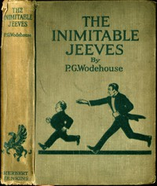

# The Inimitable Jeeves <kbd>v2.2.1</kbd>

## Authors

 - Wodehouse, P. G. (Pelham Grenville) <small>(1881 - 1975)</small>

## Translators

## Subjects

 - England
 - Humorous stories
 - Jeeves (Fictitious character)
 - Single men
 - Upper class
 - Valets
 - Wooster, Bertie (Fictitious character)

## Readablility

 - **A1:** 79%
 - **A2:** 84%
 - **B1:** 89%
 - **B2:** 94%
 - **C1:** 98%
 - **C2:** 100%

## Words Count

 - **A1:** 490
 - **A2:** 450
 - **B1:** 772
 - **B2:** 1066
 - **C1:** 1187
 - **C2:** 798

## Source

<kbd>GUTHENBURGE:59254</kbd>
