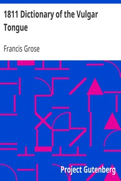

# 1811 Dictionary of the Vulgar Tongue <kbd>v2.3.0</kbd>

## Authors

 - Grose, Francis <small>(-1 - 1791)</small>

## Translators

## Subjects

 - English language

## Readablility

 - **A1:** 69%
 - **A2:** 74%
 - **B1:** 80%
 - **B2:** 86%
 - **C1:** 93%
 - **C2:** 99%

## Words Count

 - **A1:** 488
 - **A2:** 455
 - **B1:** 782
 - **B2:** 1197
 - **C1:** 1643
 - **C2:** 1675

## Source

<kbd>GUTHENBURGE:5402</kbd>
